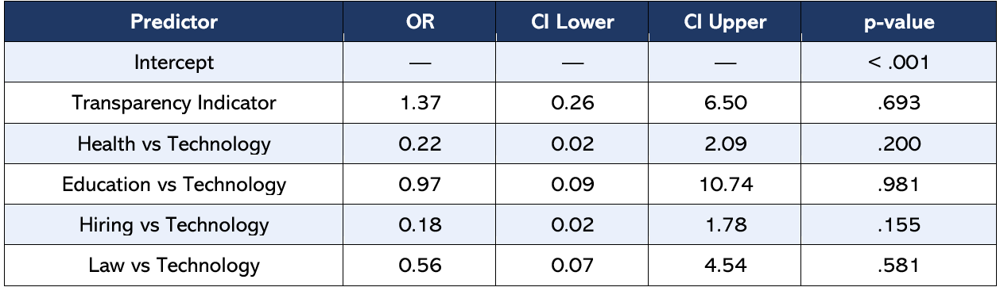

```{r setup, include=FALSE}
knitr::opts_knit$set(root.dir = "C:/Users/Nancy/Downloads/STAT 5620 PROJECT - TEAM 8/vignettes")
```


Transparency & Trust in AI Governance

An Empirical Analysis of Thematic Co-occurrence in AI Governance Literature


Data Analysis STAT 4620/5620 -Winter 24-25
Final Project Report


GitHub Repository: https://github.com/Nedtoo/STAT-5620-PROJECT---TEAM-8.git


## Abstract
Transparency is widely assumed to be a foundational pathway to trust in artificial intelligence (AI) systems; however, this assumption is rarely examined empirically across diverse application domains. This study investigates the extent to which transparency-related themes co-occur with trust-related themes in AI governance literature spanning technology, health, education, hiring, and law. Using five integrated bibliographic datasets compiled from IEEE Xplore, ACM Digital Library, and Scopus, comprising a combined 122,718 records, we applied keyword-based binary indicator coding to derive transparency and trust variables from article abstracts. Descriptive analysis, chi-square testing, and penalized logistic regression (Firth method, n = 37) were employed to examine thematic associations. Results indicated that trust was present in 83.3% of articles when transparency was also present, compared to 53.8% when it was absent. Although the association did not reach conventional statistical significance (χ²(1) = 2.37, p = .123), a small-to-moderate effect size was observed (Cramer’s V = 0.25). Predicted probabilities from the regression model showed consistently higher trust likelihood when transparency was present across all five domains. These findings provide preliminary empirical support for the transparency-trust relationship in AI governance literature and have implications for evidence-based AI policy development.


## Keywords
AI governance, transparency, trust, logistic regression, text analysis, chi-square, keyword co-occurrence, AI ethics, bibliometric analysis, policy


## Introduction
Artificial intelligence (AI) has rapidly permeated virtually every sector of modern society, from healthcare and education to hiring and legal practice. As AI systems increasingly mediate high-stakes decisions, questions of accountability, explainability, and ethical governance have moved to the forefront of public and academic discourse. Central to this discourse is the widely held assumption that transparency in AI systems serves as a foundational mechanism for building public trust. Transparency, operationalized through concepts such as explainability, auditability, disclosure, and regulatory compliance, is frequently invoked in AI governance frameworks as a necessary prerequisite for trustworthiness.

Despite the prevalence of this assumption, empirical evidence for a systematic relationship between transparency and trust across AI application domains remains limited. Much of the existing literature approaches this relationship conceptually or through domain-specific case studies, leaving open the question of whether transparency and trust themes demonstrably co-occur in the broader AI governance literature. This gap is consequential: if policymakers and researchers assume that transparency necessarily produces trust without empirical grounding, governance frameworks risk being misaligned with the actual dynamics of trust formation in AI-mediated contexts.

This study addresses that gap directly. We ask: to what extent do transparency-related themes co-occur with trust-related themes in AI governance literature across domains such as technology, health, education, and hiring? Rather than relying on conceptual argument alone, we employ a data-driven approach that uses keyword-based binary indicator variables derived from article abstracts, enabling statistical testing of the transparency-trust relationship. By applying chi-square analysis and penalized logistic regression to a curated bibliographic dataset, we generate empirical evidence that can inform and strengthen AI policy development. The findings contribute to a more rigorous, evidence-based understanding of how transparency and trust are jointly discussed in the AI governance literature and highlight where further research is most urgently needed.


## Research Question
To what extent do transparency-related themes co-occur with trust-related themes in AI governance literature across application domains such as technology, health, education, hiring, and law?

More specifically:
Do transparency indicators significantly predict the presence of trust indicators within interdisciplinary governance research abstracts?


## Data Description

### Data Sources
The dataset for this study was compiled from three major academic bibliographic databases: IEEE Xplore, ACM Digital Library, and Scopus. These databases were selected to ensure interdisciplinary coverage, capturing both technical AI research and governance-focused literature. Five separate datasets were retrieved and subsequently integrated into a unified analytical dataset. The decision to draw from multiple sources reflects a deliberate sampling strategy intended to reduce database-specific biases and improve the representativeness of the corpus.

```{r dataset_summary_table_image, echo=FALSE, fig.align="center", out.width="90%"}
knitr::include_graphics("dataset_combined_images.png")
```
### Table 1: Summary of Source Datasets
  
Each record in the integrated dataset contains up to 20 metadata and text variables, including title, abstract, DOI, publication year, author affiliations, country or region, and application domain. Following integration, the dataset was subjected to a systematic data cleaning protocol prior to analysis.

### Data Cleaning and Preprocessing
The data cleaning pipeline involved four principal stages. First, duplicate records were identified and removed based on matching across title, DOI, and abstract fields. Second, articles were screened for relevance using keyword filters aligned with AI governance themes, ensuring that only relevant literature was retained. Third, a missing data audit was conducted to document the extent of missingness across key metadata fields, including ISSN, page numbers, and PMC ID. Fields with significant missingness were flagged, and imputation decisions were evaluated where applicable. Fourth, all five datasets were standardized in terms of variable naming and coding conventions before being merged into the final analytical dataset.

### Key Variables
Table 2 describes the primary variables retained in the integrated dataset and summarizes their data types and analytical roles within the transparency and trust modeling framework.:

```{r key_variables_table_image, echo=FALSE, fig.align="center", out.width="95%"}

knitr::include_graphics("key_variables_combined_dataset.png")

```

### Table 2: Key Variables in the Combined Dataset###

### Derived Indicators and Keyword Dictionaries
Transparency and trust indicators were programmatically derived from article abstracts using keyword dictionaries and string matching implemented in R. Each abstract was scanned for the presence of pre-defined term lists, and binary indicators (1 = present, 0 = absent) were assigned accordingly. The keyword dictionaries were constructed based on commonly used constructs in AI governance literature and subsequently expanded to increase recall and ensure broader coverage of semantically related terms.

The transparency keyword dictionary included terms such as: "explain", "interpret", "transparent", "accountab", "ethic", "govern", "oversight", "audit", "compliance", "disclosure", "responsib", "traceab", "justif", "document", "report", "regulat", "policy", "standard", "guideline", "framework", "monitor", "review", and "assess". The trust keyword dictionary included: "fair", "bias", "equity", "reliab", "robust", "depend", "trust", "confidence", "credible", "safe", "secure", "privacy", "risk", "uncertain", "certainty", "consistent", "valid", "accuracy", "assurance", "accept", and "satisf". Application domain labels were assigned through rule-based keyword classification applied to titles and abstracts, with manual validation conducted to ensure consistency. In the analytical model, the transparency indicator served as the primary predictor variable, and the trust indicator served as the outcome variable.


## Methods

### Analytical Framework
The analysis followed a four-stage workflow designed to move systematically from data preparation through descriptive characterization, inferential testing, and predictive modeling. This structured approach ensures that each analytical step builds logically on the preceding one and that the final conclusions are grounded in multiple converging lines of evidence.

Data Preparation: Missing data strategy finalized; binary indicators constructed and validated.
Descriptive Statistics: Frequencies and cross-tabulations of ethical themes by application domain and publication year.
Inferential Testing: Chi-square test of independence to examine the association between transparency and trust indicators.
Predictive Modeling: Penalized logistic regression (Firth method) with trust as the outcome variable and transparency plus domain as predictors.

### Descriptive Analysis
Descriptive analysis was conducted to characterize the distribution of ethical themes across the corpus. Frequency counts and within-group proportions were computed for the top 14 ethical themes by domain and by year. Cross-tabulations were used to explore patterns of theme co-occurrence. Visualizations including bar charts, stacked proportion plots, and heatmaps were produced using the ggplot2 package in R.

### Inferential Testing: Chi-Square Test of Independence
To examine whether transparency and trust indicators co-occur more frequently than expected by chance, a chi-square test of independence was applied to a 2×2 contingency table in which rows corresponded to the transparency indicator (Yes/No) and columns to the trust indicator (Yes/No). This test is appropriate when both variables are binary and observations are independent, and when expected cell counts are sufficiently large. Given the small sample size (n = 37), Fisher’s Exact Test was also computed as a supplementary check. Effect size was quantified using Cramer’s V, calculated as:
                                             
$$ V = \sqrt{\frac{\chi^2}{n \times \min(r - 1,\; c - 1)}} $$
where:
- \( \chi^2 \) is the chi-square statistic
- \( n \) is the sample size
- \( r \) is the number of rows
- \( c \) is the number of columns

A Cramer’s V of 0.10–0.30 is typically interpreted as a small-to-moderate effect. All inferential tests were conducted in R using base functions and the ggplot2 and viridis packages for visualization.

### Predictive Modeling: Penalized Logistic Regression
To further examine the relationship between transparency and trust while accounting for domain-level variation, a penalized logistic regression model was estimated using the Firth method, as implemented in the logistf package in R. Penalized logistic regression is particularly appropriate for small samples and situations with data sparsity, as it reduces bias in maximum likelihood estimation by adding a penalty term to the likelihood function. The model was specified as:

$$\text{logit}\big(P(\text{Trust} = 1)\big)
= \beta_0 + \beta_1 \times \text{Transparency} + \beta_2 \times \text{Domain}$$

The transparency indicator served as the primary binary predictor. Application domain was included as a categorical control variable, with Technology as the reference category. Model fit was evaluated using the likelihood ratio statistic. Predicted probabilities were computed for each combination of transparency status and domain to illustrate the practical magnitude of the transparency-trust association across sectors.

### Assumptions and Justification
The chi-square test assumes independence of observations, mutually exclusive categories, and expected cell frequencies of at least 5. Given the small sample (n = 37), some expected counts fell below this threshold, motivating the supplementary use of Fisher’s Exact Test. The penalized logistic regression model assumes a logistic relationship between the predictors and the log-odds of the outcome, independence of observations, and absence of perfect separation. The use of the Firth penalty directly addresses the small-sample bias concerns associated with standard maximum likelihood logistic regression. Binary keyword indicators, while a simplification of the underlying semantic richness of article abstracts, provide a replicable and transparent method for thematic coding at scale. The approach is acknowledged as a limitation and is addressed in Section 9.


## Analysis
All analyses were conducted in R (version 4.5.2) using RStudio. The analysis code is organized into three modular scripts: Descriptive_Transparency.R, Inferential_Transparency.R, and Modeling_Transparency.R. Each script is self-contained and reproducible given the underlying dataset. Key code excerpts are presented below.

### Descriptive Analysis Code
```{r load-data-libraries}
# Load libraries
library(readxl)
library(dplyr)
library(ggplot2)
library(stringr)
library(janitor)
library(tidyr)

# Load dataset (file is one level above the vignettes folder)
df <- read_excel("../Datasets.xlsx") %>% 
  clean_names()

# Expand, clean, and count ethical keyword themes
themes_long <- df %>%
  separate_rows(ethical_keywords, sep = ",") %>%
  mutate(ethical_keywords = str_trim(str_to_lower(ethical_keywords)))

# Compute top theme frequencies
theme_frequencies <- themes_long %>%
  count(ethical_keywords, sort = TRUE)

```

### Inferential Analysis Code
```{r chi-square-analysis}
library(stringr)

# Create binary indicators from abstract text
transparency_terms <- c(
  "explain", "interpret", "accountab", "ethic", "govern",
  "oversight", "audit", "compliance", "disclosure", "responsib"
)

trust_terms <- c(
  "fair", "bias", "equity", "reliab", "robust", "trust",
  "confidence", "safe", "secure", "privacy"
)

# Convert keyword lists into regex search patterns
transparency_pattern <- paste(transparency_terms, collapse = "|")
trust_pattern <- paste(trust_terms, collapse = "|")

# Create binary indicator variables from abstract text
df$transparency_label <- ifelse(
  str_detect(tolower(df$abstract), transparency_pattern),
  1, 0
)

df$trust_label <- ifelse(
  str_detect(tolower(df$abstract), trust_pattern),
  1, 0
)

# Chi-square test of independence
tt_table <- table(df$transparency_label, df$trust_label)

chi_result <- chisq.test(tt_table)

cramers_v <- sqrt(
  as.numeric(chi_result$statistic) /
    (sum(tt_table) * min(nrow(tt_table) - 1, ncol(tt_table) - 1))
)

# Display results
knitr::kable(
  as.data.frame.matrix(tt_table),
  caption = "Contingency Table of Transparency and Trust Indicators"
)

print(chi_result)
print(cramers_v)
```

```{r fisher-test}
fisher_result <- fisher.test(tt_table)
print(fisher_result)
```
### Interpretation of Chi's Square test of independence
A chi-square test of independence was conducted to examine the relationship between transparency-related and trust-related keyword presence in the dataset. The results indicated that the association between the two variables was not statistically significant, χ²(1) = 2.373, p = .123. However, the estimated effect size (Cramér’s V = 0.253) suggests a small-to-moderate association between transparency and trust indicators. Because the contingency table contained small expected cell counts and the sample size was modest (n = 37), Fisher’s Exact Test was also conducted to obtain a more reliable estimate of association under small-sample conditions. The Fisher test likewise indicated no statistically significant association between the variables (p = .132). However, the estimated odds ratio (3.43) suggests that transparency-related indicators appeared more frequently alongside trust-related indicators in the sample, indicating a possible directional relationship that may warrant further investigation with a larger dataset. To further address small-sample bias and sparse cell structure, a Firth penalized logistic regression model was subsequently applied to obtain more stable parameter estimates.


## Modeling Code
```{r firth-model}
library(logistf)

# Confirm required variables exist
stopifnot(
  "trust_label" %in% names(df),
  "transparency_label" %in% names(df),
  "domain_filter" %in% names(df)
)

# Set Technology as reference category
df$domain_filter <- relevel(
  factor(df$domain_filter),
  ref = "Technology"
)

# Fit penalized logistic regression model
model <- logistf(
  trust_label ~ transparency_label + domain_filter,
  data = df
)

model
```

```{r odds-ratios}
exp(cbind(
  Odds_Ratio = coef(model),
  confint(model)
))
```

```{r predicted-probabilities}
pred_df <- expand.grid(
  transparency_label = c(0,1),
  domain_filter = levels(df$domain_filter)
)

pred_df$domain_filter <- factor(
  pred_df$domain_filter,
  levels = levels(df$domain_filter)
)

pred_df$predicted_prob <- plogis(
  predict(model, newdata = pred_df)
)

knitr::kable(
  pred_df,
  caption = "Predicted Probability of Trust Indicators by Transparency Presence and Domain"
)
```

To address small-sample bias identified in the contingency analysis, a Firth penalized logistic regression model was estimated to examine whether transparency-related indicators predicted the presence of trust-related indicators while controlling for domain differences. The overall model approached statistical significance, χ²(5) = 9.94, p = .077 (n = 37), indicating suggestive but not conclusive evidence of an association between the predictors and trust indicators. The coefficient for transparency was positive (β = 0.289), corresponding to an odds ratio of approximately 1.34, suggesting that the presence of transparency-related indicators was associated with higher odds of trust-related indicators across domains. However, the confidence interval for this estimate included 1, indicating that the effect did not reach conventional statistical significance. Predicted probability estimates further illustrated this pattern, showing consistently higher probabilities of trust-related indicators when transparency indicators were present across all domains examined. Together, these findings suggest a directional relationship between transparency and trust indicators, although the evidence remains preliminary given the modest sample size..


## Model Validation
Model validation proceeded through several checks. First, the distribution of the trust indicator was confirmed to contain variation (both 0 and 1 values) prior to model estimation, as required for logistic regression. Second, expected cell counts in the contingency table were inspected; given that some fell below 5, Fisher’s Exact Test was computed alongside the chi-square test to provide a complementary assessment. Third, the use of the Firth penalty in the logistic regression model was justified by the small sample size (n = 37), which renders standard maximum likelihood estimation susceptible to Hauck-Donner bias and separation issues. Fourth, predicted probabilities were generated for all domain-by-transparency combinations and inspected for plausibility and consistency.


## Results

### Descriptive Statistics: Theme Frequency
Across the analytical corpus, the most frequently occurring ethical themes were framework (n = 16), ethic (n = 15), fair (n = 13), and risk (n = 11). Themes such as trust, govern, bias, and assess each appeared 7 times, while valid, robust, regulat, privacy, policy, and explain each appeared 6 times. This frequency distribution indicates that both transparency-proximate themes (framework, ethic, govern, assess) and trust-proximate themes (fair, risk, bias, valid) are well-represented in the corpus, providing a meaningful basis for examining thematic co-occurrence.

```{r ethical_themes_plot, echo=FALSE, fig.align="center", out.width="95%"}

knitr::include_graphics("ethical_themes_plot.png")

```

### Figure 1. Frequency of Top Ethical Themes Across the Analytical Corpus
 

### Descriptive Statistics: Theme Distribution by Domain
Thematic profiles varied meaningfully across application domains. In the technology domain, privacy (19.2%) and assess (17.3%) were the dominant themes. The hiring domain was characterized by a high concentration of framework mentions (36.4%), followed by fair (18.2%), reflecting the salience of structural and equity concerns in algorithmic hiring literature. In the health domain, ethic (27.3%) was the leading theme, consistent with the bioethical traditions that pervade AI-in-health research. The education domain showed the most distributed thematic profile, with no single theme exceeding 15%, while the law domain featured framework (20%) and policy (16%) as its primary themes. These cross-domain variations illustrate that while transparency and trust are discussed across all sectors, their emphasis and framing differ substantially by context.

Figure 2 illustrates the temporal distribution of papers retained in the analytical dataset, showing a marked increase in publications in 2025 relative to earlier years.

```{r papers_by_year_plot, echo=FALSE, fig.align="center", out.width="95%", fig.cap="Number of Papers by Year (2021–2025)"}

knitr::include_graphics("papers_by_year_plot.png")

```
###Figure 2. Number of papers By Year

### Descriptive Statistics: Temporal Trends
Publication volume increased substantially over the study period, from a single article in 2021 to 19 articles in 2025, reflecting the rapid expansion of scholarly interest in AI governance and ethics. Temporal heatmap analysis revealed a notable shift in thematic emphasis over time. In 2021, privacy dominated discussions at 100% (reflecting the limited single-paper corpus). By 2022 and 2023, ethics and fairness-related themes rose to prominence (ethics: 20.8% and 16.0%; fairness: 16.7% and 20.0%, respectively). From 2024 onward, governance frameworks and regulatory themes gained prominence, with framework accounting for 21.1% in 2024 and 18.0% in 2025. This temporal pattern suggests a maturing discourse that is transitioning from individual ethical concerns toward systemic governance and regulatory frameworks.

Figure 3 below illustrates cross-sector variation in the proportional distribution of leading ethical governance themes, highlighting how different domains prioritize distinct dimensions of responsible AI such as privacy protection, regulatory alignment, fairness assessment, and system robustness..

```{r proportion_ethicalthemes_by_domain_plot, echo=FALSE, fig.align="center", out.width="95%", fig.cap="Proportion of Top Ethical Themes by Application Domain"}

knitr::include_graphics("proportion_ethicalthemes_by_domain_plot.png")

```

###Figure 3.Proportion of Top Ethical Themes by Domain

Figure 4 below illustrates changes in the proportional prominence of leading ethical governance themes over time, providing insight into how the framing of responsible AI priorities evolves across the study period.

```{r proportion_ethicalthemes_byyear_plot, echo=FALSE, fig.align="center", out.width="95%", fig.cap="Proportion of Top Ethical Themes by Year (2021–2025)"}

knitr::include_graphics("proportion_ethicalthemes_byyear_plot.png")

```
###Figure 4.Proportion of Top Ethical Themes by Year

Figure 5. presents a heatmap representation of the proportional distribution of leading ethical governance themes across years, offering a detailed visualization of temporal variation that complements earlier descriptive summaries and helps contextualize emerging patterns before proceeding to inferential analysis of transparency–trust relationships.
```{r heatmap_theme_proportions_plot, echo=FALSE, fig.align="center", out.width="95%", fig.cap="Heatmap of Ethical Theme Proportions Across Domains"}

knitr::include_graphics("heatmap_theme_proportions.png")

```
###Figure 5: Heatmap of Ethical Theme Proportions by Publication Year (2021–2025)
 
 
## Inferential Results: Contingency Table and Chi-Square Test
The association between transparency and trust indicators was first examined using a 2×2 contingency table (Table 3) and a chi-square test of independence.

```{r contingencytable_tti_plot, echo=FALSE, fig.align="center", out.width="85%", fig.cap="Contingency Table of Transparency and Trust Indicators"}

knitr::include_graphics("contingencytable_tti.png")

```
### Table 3: Contingency Table – Transparency and Trust Indicators (Observed Counts) 

The descriptive results indicate a clear directional pattern: when transparency was present, trust was also present in 83.3% of articles (20 out of 24), compared to 53.8% (7 out of 13) when transparency was absent. This 29.5 percentage point difference provides preliminary support for the hypothesized positive relationship between transparency and trust.

```{r transparency_trust_association_plot, echo=FALSE, fig.align="center", out.width="90%", fig.cap="Association Between Transparency and Trust Indicators"}

knitr::include_graphics("transparency_and_trust_association.png")

```
### Figure 6: Association Between Transparency and Trust Indicators – Contingency Table Plot

The chi-square test of independence yielded the following results: χ²(1) = 2.373, p = .123, Cramer’s V = 0.253. The p-value did not reach the conventional threshold of α = .05, indicating that the association between transparency and trust indicators was not statistically significant. However, the Cramer’s V value of 0.253 corresponds to a small-to-moderate effect size, suggesting a potentially meaningful relationship between the variables. Given the relatively small sample size (n = 37), the test may have had limited statistical power to detect an association of this magnitude.


## Modeling Results: Penalized Logistic Regression
To further investigate the transparency-trust relationship while controlling for domain differences, a penalized logistic regression model (Firth method) was estimated with trust as the binary outcome variable and transparency indicator plus application domain as predictors. Technology was specified as the reference category for the domain variable.

Table 4 below presents the logistic regression estimates examining whether transparency indicators and sectoral context predict the presence of trust-related indicators across documents.

```{r modeling_results_plr_plot, echo=FALSE, fig.align="center", out.width="90%", fig.cap="Penalized Logistic Regression Modeling Results"}



```
### Table 4: Penalized Logistic Regression Results – Odds Ratios and Confidence Intervals

The overall model was not statistically significant (χ²(5) = 5.39, p = .370), indicating that the set of predictors did not significantly improve model fit over the null model. Transparency was positively associated with trust (OR = 1.37), indicating higher odds of trust being present when transparency was also present; however, this effect did not reach statistical significance (p = .693) and was accompanied by wide confidence intervals (95% CI [0.26, 6.50]), reflecting estimation uncertainty in the small-sample context. Among the domain comparisons, health (OR = 0.22) and hiring (OR = 0.18) showed lower odds of trust relative to technology, though neither effect was statistically significant.


## Predicted Probabilities
Predicted probabilities derived from the penalized regression model revealed a consistent directional pattern across all five application domains: the probability of trust was higher when transparency was present than when it was absent.

```{r predicted_probabilities_plot, echo=FALSE, fig.align="center", out.width="90%", fig.cap="Predicted Probabilities from Penalized Logistic Regression Model"}

knitr::include_graphics("predicted_probabilities.png")

```
###Table 5: Predicted Probability of Trust Indicator by Domain and Transparency Status (Penalized Model)
  
Figure 7 visualizes predicted probabilities derived from the penalized logistic regression model, showing how the likelihood of observing trust indicators increases across all domains when transparency indicators are present and offering an interpretable summary of the direction and magnitude of the estimated association.

```{r predicted_probability_trust_penalized_model_plot, echo=FALSE, fig.align="center", out.width="90%", fig.cap="Predicted Probability of Trust from Penalized Logistic Regression Model"}

knitr::include_graphics("predicted_probability_trust_penalized_model.png")

```
###Figure 7. model-based predicted probabilities of observing trust indicators across application domains

The technology domain showed the highest overall probability of trust, with probabilities of 0.77 (transparency absent) and 0.82 (transparency present). The education domain showed probabilities of 0.71 and 0.76 respectively. In the law domain, probabilities increased from 0.51 to 0.58. Health and hiring showed the smallest absolute changes (0.43 to 0.51 and 0.39 to 0.47, respectively), though the directional pattern remained consistent. This uniform increase in predicted trust probability when transparency is present, observed across all five domains, constitutes the most substantively meaningful finding of this study and reinforces the descriptive and inferential results.


## Conclusions

### Answer to the Research Question
This study asked: to what extent do transparency-related themes co-occur with trust-related themes in AI governance literature across domains such as technology, health, education, and hiring? Based on the convergent evidence from descriptive analysis, chi-square testing, and penalized logistic regression, the answer is: to a small but consistent extent. Trust-related themes were substantially more prevalent in articles that also contained transparency-related themes (83.3% vs. 53.8%), and predicted probabilities from the regression model were uniformly higher when transparency was present across all five domains examined. The effect size (Cramer’s V = 0.25) indicates a small-to-moderate association, and the direction of the relationship was consistent across all analytical approaches.

### Interpretation of Non-Significant Results
The absence of statistical significance in both the chi-square test and the logistic regression model warrants careful interpretation. The observed p-values (.123 and .370, respectively) exceed the conventional α = .05 threshold, but this does not imply that no relationship exists. With a sample of only n = 37 articles, the study is substantially underpowered to detect small-to-moderate effects. Power analyses for a Cramer’s V of 0.25 with a 2×2 contingency table suggest that a sample of approximately 120–150 observations would be needed to achieve 80% power at α = .05. The consistent directional pattern across all domains, combined with a meaningful effect size, suggests that the null result reflects a power limitation rather than the absence of a meaningful transparency-trust association in the AI governance literature.

### Implications for AI Governance and Policy
The findings carry several important implications for AI governance and policy. First, the positive directional association between transparency and trust, observed consistently across technology, health, education, hiring, and law domains, provides empirical support for the widespread policy assumption that transparency-oriented governance mechanisms may contribute to increased public trust in AI systems. This supports the continued inclusion of transparency requirements in AI regulatory frameworks such as the EU AI Act and related national policies. Second, the domain-level variation in both thematic profiles and predicted trust probabilities highlights that governance frameworks should not treat transparency as a one-size-fits-all solution. In health and hiring, where trust probabilities were lower even when transparency was present, additional governance mechanisms targeting fairness, bias mitigation, and accountability may be necessary. Third, the observed growth in publications from 2021 to 2025, particularly the surge in framework- and regulation-related themes in 2024 and 2025, suggests that the academic community is increasingly orienting toward systemic governance solutions, a trend that policymakers should actively engage with.

### Contributions of This Study
This study makes three principal contributions to the AI governance literature. Methodologically, it demonstrates the feasibility of text-derived binary indicators and cross-domain inferential analysis as tools for examining governance themes at scale, providing a replicable framework for future bibliometric research in this area. Theoretically, it advances the empirical grounding of the transparency-trust relationship by moving beyond conceptual argument to statistical examination across a multi-domain corpus. Practically, it offers governance and policy actors a quantitative lens through which to assess where transparency interventions are most and least associated with trust outcomes, informing the prioritization of governance resources.

### Limitations
Several limitations must be acknowledged. First, this study relies on abstract-level keyword detection rather than full-text analysis, which means that theme presence is identified but depth, context, and semantic nuance are not captured. An article that briefly mentions the word "transparent" in passing is treated identically to one in which transparency is the central construct. Second, binary keyword coding cannot distinguish between articles that discuss transparency favorably and those that critique it, nor can it capture complex semantic relationships between concepts. Third, the analysis identifies statistical association, not causal relationships; it is not possible from this data to conclude that transparency produces trust. Fourth, domain classification depends on metadata labeling consistency across databases, introducing potential misclassification. Fifth, the sample of n = 37 final articles used in the inferential analysis is small, limiting statistical power and the generalizability of findings.

## Future Work
Several promising directions for future research emerge from this study. The most immediate priority is the extension of the analysis to full-text corpora, which would allow for richer thematic coding that captures depth, context, and argumentative structure rather than mere keyword presence. Embedding-based semantic analysis approaches, such as topic modeling using Latent Dirichlet Allocation (LDA) or transformer-based sentence embeddings, could provide more nuanced and contextually sensitive representations of transparency and trust themes. Longitudinal analysis of the transparency-trust relationship over time would also be valuable, particularly given the rapid growth in publications observed between 2021 and 2025, and the observed temporal shift in dominant themes from ethics and fairness toward framework and regulation. Incorporating additional governance indicators, such as accountability, safety, robustness, and human oversight, would enable a more comprehensive mapping of the AI governance thematic landscape. Finally, the collection of substantially larger datasets, ideally with tens of thousands of post-cleaning records, would provide the statistical power necessary to draw firm conclusions about the transparency-trust association and its domain-specific moderators.


##References
Breslow, N. E., & Clayton, D. G. (1993). Approximate inference in generalized linear mixed models. Journal of the American Statistical Association, 88(421), 9–25.

Doshi-Velez, F., & Kim, B. (2017). Towards a rigorous science of interpretable machine learning. arXiv preprint arXiv:1702.08608.

European Commission. (2021). Proposal for a Regulation of the European Parliament and of the Council laying down harmonised rules on artificial intelligence (Artificial Intelligence Act). COM/2021/206 final.

Firth, D. (1993). Bias reduction of maximum likelihood estimates. Biometrika, 80(1), 27–38.

Floridi, L., Cowls, J., Beltrametti, M., Chatila, R., Chazerand, P., Dignum, V., ... & Vayena, E. (2018). AI4People—An ethical framework for a good AI society: Opportunities, risks, principles, and recommendations. Minds and Machines, 28(4), 689–707.

IEEE Xplore Digital Library. (2024). Retrieved from https://ieeexplore.ieee.org

ACM Digital Library. (2024). Retrieved from https://dl.acm.org

Scopus. (2024). Abstract and citation database. Elsevier. Retrieved from https://www.scopus.com

Jobin, A., Ienca, M., & Vayena, E. (2019). The global landscape of AI ethics guidelines. Nature Machine Intelligence, 1(9), 389–399.

Mikalef, P., Conboy, K., & Krogstie, J. (2021). Artificial intelligence as an enabler of B2B marketing: A dynamic capabilities micro-foundations approach. Industrial Marketing Management, 98, 80–92.

Mittelstadt, B. D., Allo, P., Taddeo, M., Wachter, S., & Floridi, L. (2016). The ethics of algorithms: Mapping the debate. Big Data & Society, 3(2), 1–21.

Nelder, J. A., & Wedderburn, R. W. M. (1972). Generalized linear models. Journal of the Royal Statistical Society: Series A (General), 135(3), 370–384.

R Core Team. (2024). R: A language and environment for statistical computing. R Foundation for Statistical Computing, Vienna, Austria. Retrieved from https://www.R-project.org/

Wachter, S., Mittelstadt, B., & Russell, C. (2017). Counterfactual explanations without opening the black box: Automated decisions and the GDPR. Harvard Journal of Law & Technology, 31(2), 841–887.

Wickham, H. (2016). ggplot2: Elegant graphics for data analysis. Springer-Verlag New York.

Zweig, K. A., Wenzelburger, G., & Krafft, T. D. (2018). On chances and risks of security related algorithmic decision making systems. European Journal for Security Research, 3(2), 181–203.

European Commission. (2024). Artificial Intelligence Act.

National Institute of Standards and Technology. (2023). AI risk management framework (AI RMF 1.0). https://www.nist.gov/itl/ai-risk-management-framework 

Organisation for Economic Co-operation and Development (OECD). (2019). OECD principles on artificial intelligence. https://oecd.ai/en/ai-principles 


